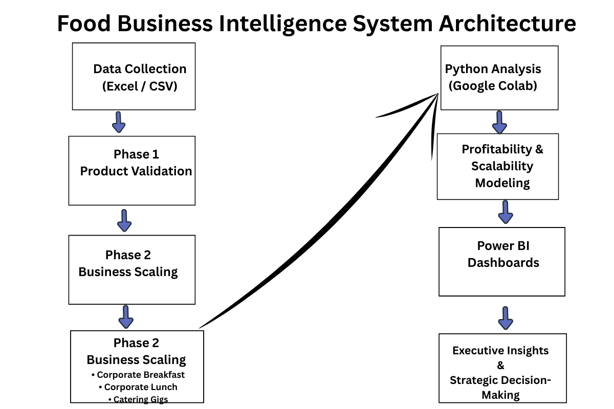

# Food-Business-Intelligence-Analytics System
A multi-stream food business analytics project combining Power BI dashboards and Python analysis to evaluate revenue, profitability, operational performance, and catering scalability across breakfast, lunch, and catering services for strategic business decision-making.

## System Architecture

The analytical workflow follows this structure:

Data Collection (Excel / CSV)

↓

Python Analysis (Google Colab)

↓

Profitability & Scalability Modeling

↓

Power BI Dashboard Development

↓

Executive Business Intelligence Reporting

↓

Strategic Decision-Making




## Project Overview

This project is a multi-phase business intelligence and analytics system designed to analyze and optimize a food service business operating across multiple revenue streams.

The project combines Power BI dashboards and Python-based analytics to evaluate performance, profitability, operational stability, and scalability.

It is structured in two major phases:

* **Phase 1:** Single Dishes Analysis
* **Phase 2:** Corporate Meal Services & Catering Intelligence

The objective is to move from simple product-level analysis into a full multi-stream business intelligence model capable of supporting strategic decision-making.

---

## Business Problem

Food businesses often operate across different service models such as daily dishes, corporate meal plans, and event catering.

Without structured analytics, it becomes difficult to answer critical business questions:

* Which business stream generates the highest revenue?
* Which menu items are the most profitable?
* Which client segments scale best?
* Where is operational consistency strongest?
* How can pricing be optimized?

This project was built to answer those questions.

---

## Project Phases

### Phase 1 — Single Dishes Analysis

This phase focused on individual dish-level performance analysis.

Key areas analyzed:

* Dish pricing performance
* Revenue contribution by menu item
* Cost assumptions and profit estimation
* High-performing dishes
* Low-performing dishes

Purpose:

To establish the foundational profitability model before scaling into structured corporate offerings.

---

### Phase 2 — Corporate Meal & Catering Analysis

Phase 2 expands the business model into three operational streams:

#### Corporate Breakfast

A standardized breakfast package model built for consistency and stable daily revenue.

Focus areas:

* Revenue stability
* Protein dependency
* Operational consistency
* Profit consistency
* Fruit inclusion standardization

---

#### Corporate Lunch

A more dynamic meal model with variable pricing and multiple protein categories.

Focus areas:

* Pricing variability
* Revenue distribution
* Protein dependency analysis
* Profitability by day
* Premium meal opportunities

---

#### Catering Gigs

A tiered catering model designed around client group sizes.

Focus areas:

* Group size scalability
* Revenue concentration
* Profitability by tier
* Client segmentation
* Revenue efficiency ratio

---

## Tools Used

### Business Intelligence

* Microsoft Power BI

Used for:

* KPI dashboards
* Revenue comparisons
* Profitability dashboards
* Executive reporting

---

### Python Analytics

Used in Google Colab for:

* Revenue analysis
* Profit simulation
* Client segmentation
* Scalability analysis
* Executive consolidation

Libraries used:

* pandas
* matplotlib

---

## Project Structure

food-business-intelligence-analytics/
│

├── phase_1_single_dishes/

├── phase_2_corporate_and_catering/

│   ├── corporate_breakfast.csv

│   ├── corporate_lunch.csv

│   ├── catering_gigs.csv
│

├── notebooks/

│   ├── 01_Catering_Analysis.ipynb

│   ├── 02_Breakfast_Analysis.ipynb

│   ├── 03_Lunch_Analysis.ipynb

│   └── 04_Executive_Analysis.ipynb
│

├── dashboards/

│   └── Food Business Intelligence Dashboard.pbix
│

└── README.md

---

## Power BI Dashboards

### 1. Operational Performance Dashboard

Tracks:

* Breakfast performance
* Lunch performance
* Revenue consistency
* Protein distribution

---

### 2. Catering Scalability & Profitability Dashboard

Tracks:

* Revenue by group size
* Profit by group size
* Client segmentation
* Revenue efficiency

---

### 3. Business Performance Executive Dashboard

Tracks:

* Total revenue
* Total profit
* Total orders
* Profit margin
* Stream comparison

---

## Key Insights

* Catering is the strongest revenue driver.
* Breakfast provides the most stable daily cash flow.
* Lunch offers balanced revenue with variable pricing opportunities.
* Medium-sized catering packages offer the strongest efficiency.
* Large catering gigs produce the highest profit concentration.

---

## Final Results

The project successfully evolved from a single-dish profitability model into a diversified multi-stream business intelligence system.

Key outcomes:

* Catering emerged as the strongest revenue and profit driver.
* Breakfast became the most stable recurring cashflow stream.
* Lunch created flexible pricing and optimization opportunities.
* Business diversification reduced dependence on a single revenue source.
* Scalability analysis validated catering as the primary expansion channel.

The combined Power BI and Python workflow established a complete analytical foundation for operational decision-making, profitability tracking, and long-term business growth.


## Business Recommendations

* Expand catering as the primary growth engine.
* Maintain breakfast as a stable operational anchor.
* Optimize lunch pricing around premium protein combinations.
* Diversify protein sourcing to reduce supply chain dependency.
* Develop targeted client acquisition strategies for medium and large catering packages.

---

## Future Improvements

Planned analytical upgrades:

* Demand forecasting
* Cost sensitivity simulations
* Menu optimization
* Customer segmentation using machine learning
* Profit forecasting

---

How to Run

## How to Run

### Clone the repository

```bash
git clone https://github.com/yourusername/food-business-intelligence-analytics.git
```

### Install dependencies

```bash
pip install -r requirements.txt
```

### Open Python notebooks

Run the notebooks in:

* Google Colab
* Jupyter Notebook

### Load datasets

Use the CSV files inside:

* phase_2_corporate_and_catering/

### Open Power BI dashboard

Open:

Food Business Intelligence Dashboard.pbix

using Microsoft Power BI Desktop.

## Author

Built as part of a practical business intelligence and analytics portfolio focused on food operations, profitability modeling, and scalable service optimization.
